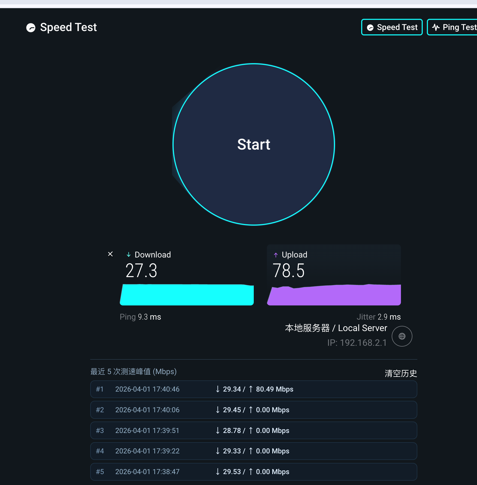
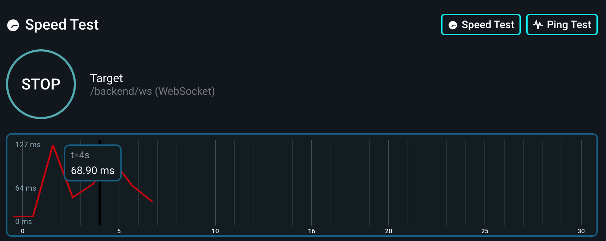

# Speedtest Lite

## 截图

### Speed Test



### Ping Test



当前界面包含以下能力：

- Speed Test 主页面
- Ping Test 页面
- 最近 5 次测速峰值历史记录
- 本地历史清空按钮

## 使用

### OpenResty

```bash
cd speedtest_lite
mkdir -p {logs,runtime}
openresty -p `pwd`/ -c conf/nginx.conf -s stop
openresty -p `pwd`/ -c conf/nginx.conf
# 访问 http://127.0.0.1/ 或者 http://127.0.0.1/v1/
```

### docker

```bash
docker run --name speedtest_lite -p 8000:80  -d linsir/speedtest_lite:latest

# 访问 http://127.0.0.1:8000/ 或者 http://127.0.0.1:8000/v1/
```
